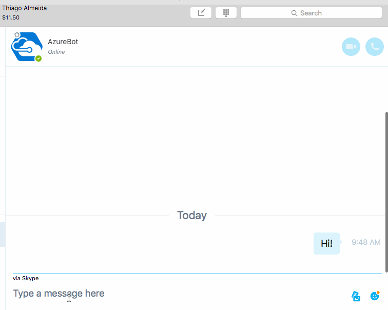

# AzureBot
The AzureBot is a sample that showcases how the Microsoft Bot Framework and Cognitive services can be used to create intelligent bots. The sample was created to show how a bot can be used to improve the productivity of any developer, admin, or team working with Azure. If you would like to set it up yourself and contribute, follow our [Developer Set Up](https://github.com/Microsoft/AzureBot/blob/gh-pages/docs/DeveloperSetup.md).

We maintain the latest version of the sample running in the [Bot Framework Bot Directory](https://bots.botframework.com/bot?id=azurebot), where you can try it via Skype, Slack or GroupMe. 

The current implementation focuses on authenticating to the user's Azure subscription, selecting and switching subscriptions, starting and stopping RM-based virtual machines, and listing and starting Azure Automation runbooks. 

## Developer Set Up

AzureBot is built with the [Microsoft Bot Framework](http://docs.botframework.com/) and the [Microsoft Bot Builder C# SDK](http://docs.botframework.com/sdkreference/csharp/). It uses the [Azure Resource Manager Nuget package](https://www.nuget.org/packages/Microsoft.Azure.Management.ResourceManager) and other Azure packages.

Follow our [Developer Set Up](https://github.com/Microsoft/AzureBot/blob/gh-pages/docs/DeveloperSetup.md) guide to get started.

## UX Guidelines

If creating new commands, our [UX Guidelines](https://github.com/Microsoft/AzureBot/blob/gh-pages/docs/UX.Guidelines.md) are helpful for the conversational tone and best practices.

## Contributing

If you are interested in contributing to this project feel free to submit a pull request to the [beta branch](https://github.com/Microsoft/AzureBot/tree/beta). If you find issues with or desire improvements for the existing functionality, please [file an issue](https://github.com/Microsoft/AzureBot/issues) here in GitHub. Note that the AzureBot is a sample and not actively supported. 

## Contact 
Please reach out to azurebot at microsoft dot c o m.  

## Code of Conduct

This project has adopted the [Microsoft Open Source Code of Conduct](https://opensource.microsoft.com/codeofconduct/).
For more information see the [Code of Conduct FAQ](https://opensource.microsoft.com/codeofconduct/faq/) or
contact [opencode@microsoft.com](mailto:opencode@microsoft.com) with any additional questions or comments.

## Copyright and license

Code released under [the MIT license](https://github.com/Microsoft/AzureBot/blob/master/LICENSE)
